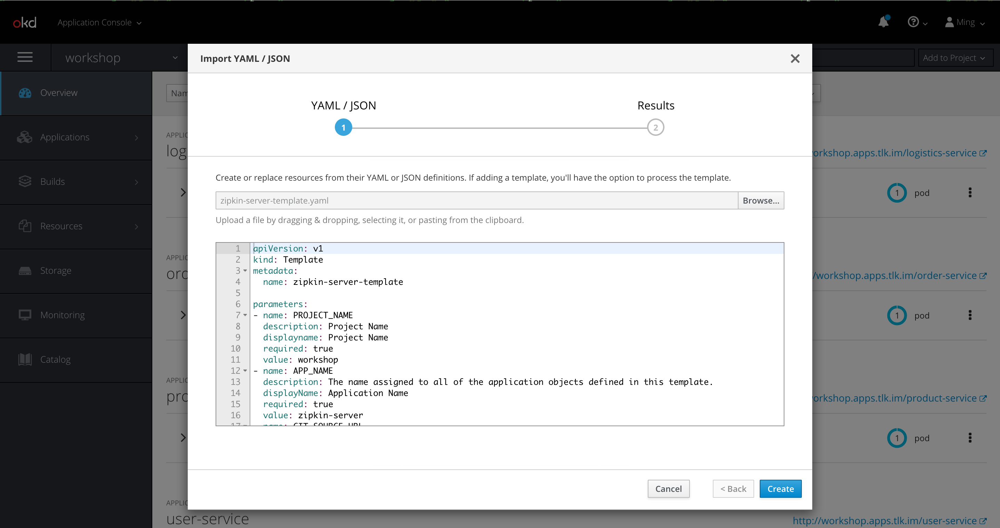
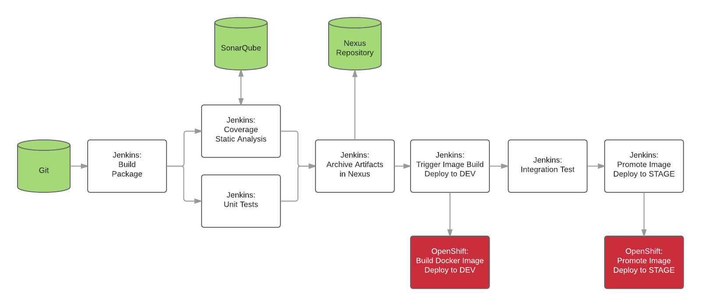

# Platform Capability Building Workshop - OpenShift

## Prerequisites
* Git
* OpenShift CLI ([Downloading Source](https://github.com/openshift/origin/releases/))
  * Download  
  ```console 
  cd ~/downloads && wget https://github.com/openshift/origin/releases/download/v3.11.0/openshift-origin-client-tools-v3.11.0-0cbc58b-linux-64bit.tar.gz
    ```
  * Uncompress file and add in PATH
  ```console
  mkdir ~/openshift-cli
  cd ~/downloads && tar xvf openshift-origin-client-tools-v3.11.0-0cbc58b-linux-64bit.tar.gz -C ~/openshift-cli --strip-components 1
  ``` 
  * Add `oc` in PATH. You can either
  ```console
  export PATH=#USER_HOME#/openshift-cli:$PATH
  ``` 


## Workshop -- part 1

### Basic check before we get started
```console
oc login https://oc.tlk.im:443 --token=#TOKEN#
```

```console
oc status
```

```console
oc new-project #PROJECT_NAME#
```

```console
oc project #PROJECT_NAME#
```

### Deploy first application on OpenShift

#### S2I builder image

Follow [Springboot S2I README.md](https://github.com/platform-guild/platform-s2i-springboot) to import S2I builder image into the online catalog.

> _Note: only continue next step only when builder image is created successfully. You can check from web console._   

#### Build service with S2I builder image

Before creating any service, you need to fork a repo under your account from [https://github.com/#YOUR_ACCOUNT#/openshift-workshop.git](https://github.com/#YOUR_ACCOUNT#/openshift-workshop.git).

Now let's create a _zipkin server_ application. 
    
There are two ways. Either to create via `oc`,
```console
oc new-app -f openshift/zipkin-server/build-deployment-config.yaml \
    -p PROJECT_NAME=#PROJECT_NAME# \ 
    -p APP_NAME=zipkin-server \
    -p GIT_SOURCE_URL=https://github.com/#YOUR_ACCOUNT#/openshift-workshop.git \
    -p GIT_SOURCE_REF=master \
    -p APP_PORT=9000 \
    -p APP_ENV=dev
```
> `new-app` command creates a **build configuration**, which itself creates a new application **image** from source code. It typically also creates **deployment configuration** to deploy the new image, and a **service** to provide load-balanced access to the deployment running your image. 

or to create via the web console as below,   


#### Start the build to get service running 
```console
oc get buildconfig

oc start-build zipkin-server
```

#### Access service
```console
oc expose service zipkin-server --hostname=#PROJECT_NAME#.apps.tlk.im --port=9000 -l app=zipkin-server
```
> It will expose zipkin-server service to hostname you specify.

Now you are able to access zipkin server via URL [http://#PROJECT_NAME#.apps.tlk.im](http://#PROJECT_NAME#.apps.tlk.im/).

#### How Source-to-Image works
For example, to create a reproducible build pipeline for Tomcat (the popular Java webserver) and Maven:

1. Create a builder image containing OpenJDK and Tomcat that expects to have a WAR file injected
2. Create a second image that layers on top of the first image Maven and any other standard dependencies, and expects to have a Maven project injected
3. Invoke source-to-image using the Java application source and the Maven image to create the desired application WAR
4. Invoke source-to-image a second time using the WAR file from the previous step and the initial Tomcat image to create the runtime image

### Deploy service with CI/CD pipeline
#### Create service from template
```console
oc create -f openshift/service/template.yaml
```
> Upload template to projects.

Once template gets uploaded, you can deploy service by the OpenShift stored template,
```console
oc process api-services-template \
    -p PROJECT_NAME=#PROJECT_NAME# \ 
        -p APP_NAME=zipkin-server \
        -p GIT_SOURCE_URL=https://github.com/#YOUR_ACCOUNT#/openshift-workshop.git \
        -p GIT_SOURCE_REF=master \
        -p APP_PORT=9000 \
        -p APP_ENV=dev | oc create -f -
```

#### Jenkins slave
```console
oc create -f openshift/jenkins/buildconfig/gradle-centos7.yaml
``` 
```console
oc start-build jenkins-slave-gradle-centos7
``` 

#### Access the service
Go to [http://#PROJECT_NAME#.apps.tlk.im/product-service/products/123](http://#PROJECT_NAME#.apps.tlk.im/product-service/products/123)


#### Make some change to application
Opens file `ProductController` and make a change to the code. Then commit and push your change.

Now manually start the build to eventually trigger the new deployment,
```console
oc start-build product-service
```

#### Auto triggering
* Define your `Secret` before actually doing it.
    ```console
    oc create -f openshift/github-webhook-secret.yaml
    ```
* Update `BuildConfig` to allow auto build triggering when there is new change is checked in codebase.

    Edit the template by,
    ```console
    oc edit template api-services-template
    ```
    Update `BuildConfig` by adding another trigger. 
    ```yaml
    triggers: 
        - type: "GitHub"
          github:
            secret: "sti-builder-secret"
    ```
To verify the auto triggering, make another change to `ProductController` then commit and push the change to check.    

#### CI/CD Model


### Best practices
#### Use of Labels
```console
oc delete all --selector="app=zipkin-server"
```
#### Template on OpenShift
```console
oc process -f zipkin-server-template.yaml | oc create -f -
```
> To create objects by giving pre-defined template.

```console
oc create -f openshift/service/template.yaml
```
> To upload template to projects. 

## Workshop -- part 2

### Scale up & down

### Rollback

### Service registration & discovery

### Logging & Monitoring

Go to [HOWTO.md](HOWTO.md) for how to configure and build the projects.