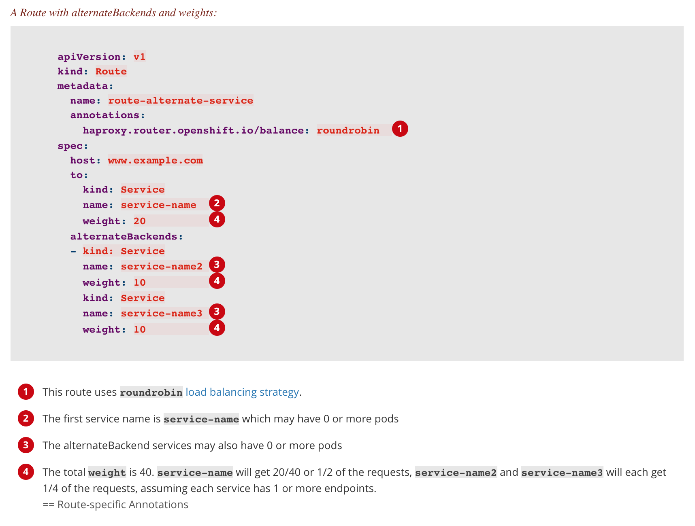

# Platform Capability Building Workshop - OpenShift

## Prerequisites
* Git
* OpenShift CLI ([Downloading Source](https://github.com/openshift/origin/releases/))
  * Download  
  ```console 
  cd ~/downloads && wget https://github.com/openshift/origin/releases/download/v3.11.0/openshift-origin-client-tools-v3.11.0-0cbc58b-linux-64bit.tar.gz
    ```
  * Uncompress file and add in PATH
  ```console
  mkdir ~/openshift-cli
  cd ~/downloads && tar xvf openshift-origin-client-tools-v3.11.0-0cbc58b-linux-64bit.tar.gz -C ~/openshift-cli --strip-components 1
  ``` 
  * Add `oc` in PATH. You can either
  ```console
  export PATH=#USER_HOME#/openshift-cli:$PATH
  ``` 


## Workshop -- part 1

### Basic check before we get started
```console
oc login https://oc.tlk.im:443 --token=#TOKEN#
```

```console
oc projects
```

```console
oc new-project #PROJECT_NAME#
```

```console
oc status
```

### Deploy first application on OpenShift

#### S2I builder image
What this repo is created for? By comparing to traditional pipeline way of build,
1. Build docker image
2. Build application
3. Run application

#### How Source-to-Image works
For example, to create a reproducible build pipeline for Tomcat (the popular Java webserver) and Maven:

1. Create a builder image containing OpenJDK and Tomcat that expects to have a WAR file injected
2. Create a second image that layers on top of the first image Maven and any other standard dependencies, and expects to have a Maven project injected
3. Invoke source-to-image using the Java application source and the Maven image to create the desired application WAR
4. Invoke source-to-image a second time using the WAR file from the previous step and the initial Tomcat image to create the runtime image

Follow [Springboot S2I README.md](https://github.com/platform-guild/platform-s2i-springboot) to import S2I builder image into the online catalog.

> _Note: only continue next step only when builder image is created successfully. You can check from web console._   

#### Build service with S2I builder image

Before creating any service, you need to fork a repo under your account from [https://github.com/#YOUR_ACCOUNT#/openshift-workshop.git](https://github.com/#YOUR_ACCOUNT#/openshift-workshop.git).

Now let's create a _zipkin server_ application. 
    
There are two ways. Either to create via `oc`,
```console
oc new-app -f openshift/zipkin-server/build-deployment-config.yaml \
    -p PROJECT_NAME=#PROJECT_NAME# \
    -p APP_NAME=zipkin-server \
    -p GIT_SOURCE_URL=https://github.com/#YOUR_ACCOUNT#/openshift-workshop.git \
    -p GIT_SOURCE_REF=master \
    -p APP_PORT=9000 \
    -p APP_ENV=dev
```
> `new-app` command creates a **build configuration**, which itself creates a new application **image** from source code. It typically also creates **deployment configuration** to deploy the new image, and a **service** to provide load-balanced access to the deployment running your image. 

or to create via the web console as below,   


#### Start the build to get service running 
```console
oc get buildconfig

oc start-build zipkin-server
```

#### Access service
Creating a **Service** first,
```console
oc expose dc/zipkin-server --name=zipkin-server -l app=zipkin-server
```

Then create a **Route**,
```console
oc expose svc/zipkin-server --name=zipkin-server --hostname=#PROJECT_NAME#.apps.tlk.im --port=9000 -l app=zipkin-server
```
> It will expose zipkin-server service to hostname you specify.

Now you are able to access zipkin server via URL [http://#PROJECT_NAME#.apps.tlk.im](http://#PROJECT_NAME#.apps.tlk.im/).

### Deploy service with CI/CD pipeline
#### Create service from template
```console
oc create -f openshift/service/template.yaml
```
> Upload template to projects.

Once template gets uploaded, you can deploy service by the OpenShift stored template,
```console
oc process api-services-template \
    -p PROJECT_NAME=#PROJECT_NAME# \
        -p APP_NAME=zipkin-server \
        -p GIT_SOURCE_URL=https://github.com/#YOUR_ACCOUNT#/openshift-workshop.git \
        -p GIT_SOURCE_REF=master \
        -p APP_PORT=9000 \
        -p APP_ENV=dev | oc create -f -
```

#### Jenkins slave
```console
oc create -f openshift/jenkins/buildconfig/gradle-centos7.yaml
``` 
```console
oc start-build jenkins-slave-gradle-centos7
``` 

#### Access the service
Go to [http://#PROJECT_NAME#.apps.tlk.im/product-service/products/123](http://#PROJECT_NAME#.apps.tlk.im/product-service/products/123)


#### Make some change to application
Opens file `ProductController` and make a change to the code. Then commit and push your change.

Now manually start the build to eventually trigger the new deployment,
```console
oc start-build product-service
```

#### Auto triggering
* Define your **Secret** before actually doing it.
    ```console
    oc create -f openshift/service/github-webhook-secret.yaml
    ```
* Update **BuildConfig** to allow auto build triggering when there is new change is checked in codebase.

    Edit the **BuildConfig** for _product-service_ by,
    ```console
    oc edit bc/product-service-docker
    ```
    Update **BuildConfig** by adding another trigger. 
    ```yaml
    triggers: 
      - type: "GitHub"
        github:
          secretReference: 
            name: "service-webhook-secret"
    ```
* Copy Webhook url from OpenShift console

    ```console
    oc describe bc/product-service-docker
    ``` 
    
* Config Webhook in github
    
    * Go to Settings of repo https://github.com/#YOUR_ACCOUNT#/openshift-workshop.git

    * Click Webhooks item to add Webhook

    * Paste the webhook URL in field Payload URL, select application/json in Content type field, click disable ssl verification

    * Github will test the webhook automatically, if succeed, it will place a green mark before the url.

To verify the auto triggering, make another change to `ProductController` then commit and push the change to check.

> Unfortunately you can not verify when the OpenShift access has networking limit.      

#### CI/CD Model


### Best practices
#### Use of Labels
```console
oc delete all --selector="app=zipkin-server"
```
#### Template on OpenShift
```console
oc process -f zipkin-server-template.yaml | oc create -f -
```
> To create objects by giving pre-defined template.

```console
oc create -f openshift/service/template.yaml
```
> To upload template to projects. 

```console
oc process api-services-template \
    -p PROJECT_NAME=#PROJECT_NAME# \ 
        -p APP_NAME=zipkin-server \
        -p GIT_SOURCE_URL=https://github.com/#YOUR_ACCOUNT#/openshift-workshop.git \
        -p GIT_SOURCE_REF=master \
        -p APP_PORT=9000 \
        -p APP_ENV=dev | oc delete -f - 
```

## Workshop -- part 2

### Rollback
To get information about all available revisions of your application, 
```console
oc rollout history dc/product-service
```

You can view details specific to a revision by using the `--revision` flag,
```console
oc rollout history dc/product-service --revision=3
```
Given you are very sure which revision you want to rollback, now you can, 

1. rollback to the last successful deployed revision of your configuration,  
    ```console
    oc rollout undo dc/product-service
    ```
    > A new replication controller will be started. If no revision is specified with --to-revision, then the last successfully deployed revision will be used.

2. Rollback to specific revision of _DeploymentConfiguration_,
    ```console
    oc rollout undo dc/product-service --to-revision=2
    ```
    > If revision is specified with --to-revision, the specific revision of deployment will be used.
 
### Scale up & down
Scale up and down via CLI like below,
```console
oc scale dc/product-service --replicas=2
```
> Verify either from Web console or from CLI by `oc describe service #SERIVCE_NAME#`

```console
oc scale dc/product-service --replicas=1
```
> Scale down to 1 to reset.

#### Auto-Scaling

By default, pods consume unbounded node resources. Therefore in terms of steps,

1. Resource limits on pods
    ```yaml
    resources:
      limits:
        cpu: 100m
      requests:
        cpu: 100m
    ```
2. Configure _autoscaler_
    ```console
    oc autoscale dc/product-service --min 1 --max 10 --cpu-percent=10
    ```
3. To verify the change,
    ```console
    ab -n 1000 -c 100 http://##
    ```

### Deployment strategies
#### Rolling strategy
Slowly replaces instances of previous version of application with the instances of new version of the application. All rolling deployments in OpenShift are _canary_ deployments.

Use this strategy when,
* no downtime during application update
* application supports having old code and new code running at the same time
 
#### Recreate strategy
Lifecycle hooks are supported for injecting code into the deployment process.
Use this strategy when,
* must run migrations or date transformations before you new code starts
* do not support having new and old version of applications running at the same time
* want to use volume which is not supported being shared between multiple replicas 

This way incurs downtime becuase for a brief period no instaces of application are running

#### Custom strategy
Apparently, this strategy allows you define your own process of deployment. 

#### Blue-Green deployment
Involves running two versions of application at the same time and moving traffic from the in-production version (green version) to the newer version (the blue version).
You can implement it either by 
* rolling strategy
* switch services in a route  

#### A/B deployment
It lets you try new version of application in a limited way in the production environment.
With full control of portion of requests to each version of application, as testing progresses you can increase the fraction of requests to the new version and ultimately stop using the old version.

By configurating **Route** object, we can achieve that.


### Logging & Monitoring

A quick showcase.

Go to [HOWTO.md](HOWTO.md) for how to configure and build the projects.